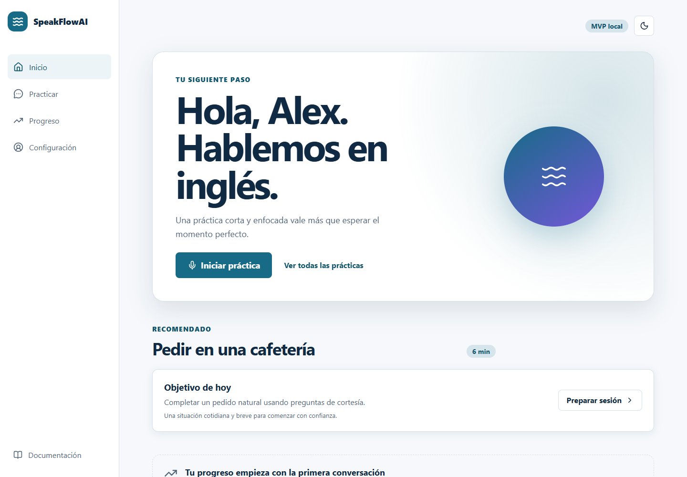
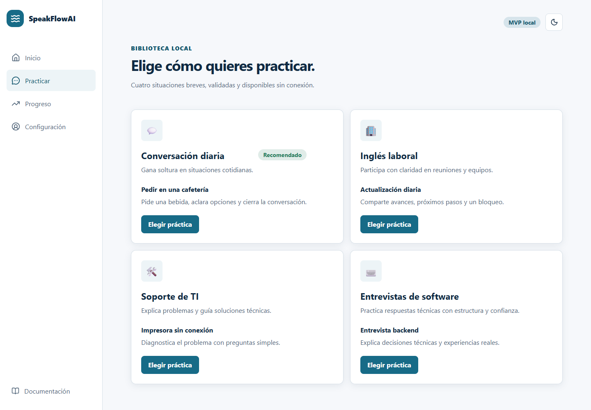
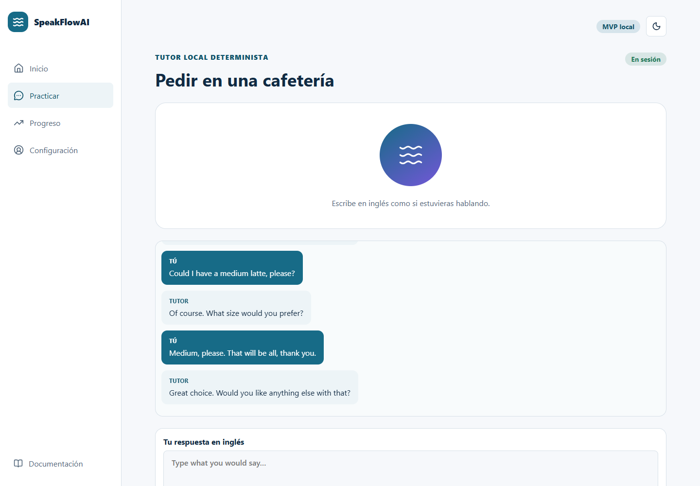
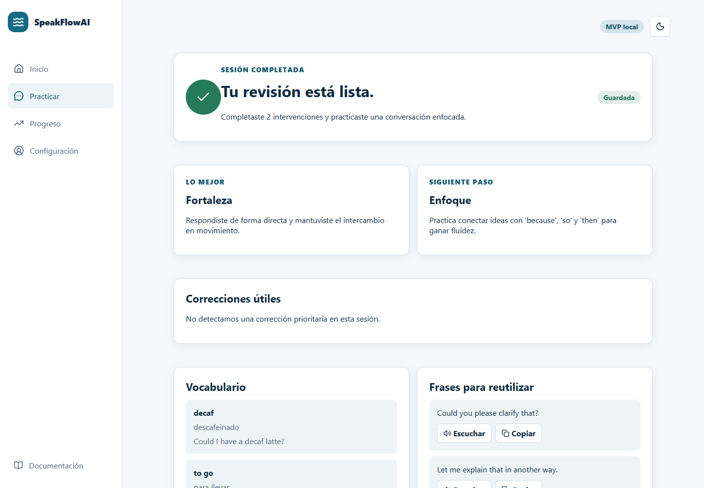
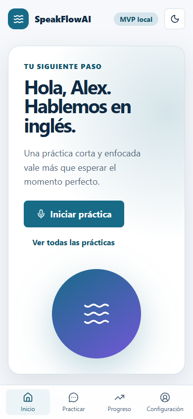

# SpeakFlowAI

SpeakFlowAI es un compañero de voz con IA para que una persona adulta practique inglés con menos ansiedad, objetivos claros y retroalimentación útil. El MVP es una aplicación personal, local y sin autenticación.

<p align="center">
  
</p>

## Qué incluye

- conversación por voz en tiempo real, mediada por el backend para proteger la clave;
- modo escrito local y determinista cuando no se desea usar el proveedor de voz;
- escenarios de vida diaria, trabajo, soporte técnico y entrevistas;
- revisión con fortalezas, enfoque, vocabulario y frases reutilizables;
- progreso local sin cuenta y sin conservar audio;
- interfaz responsive, documentación navegable y proyectos Capacitor para Android e iOS.

## Estado

Las **Fases 0 a 8** están completas y conforman la versión **1.0.0**. La
experiencia incluye onboarding, escenarios, tutor local, voz Realtime, feedback,
progreso, proyectos móviles y un paquete de publicación.

- Estado detallado: [CURRENT_STATUS.md](CURRENT_STATUS.md)
- Informe de cierre: [PHASE_0_COMPLETION_REPORT.md](PHASE_0_COMPLETION_REPORT.md)
- Cierre de Fase 1: [PHASE_1_COMPLETION_REPORT.md](PHASE_1_COMPLETION_REPORT.md)
- Cierre de Fase 2: [PHASE_2_COMPLETION_REPORT.md](PHASE_2_COMPLETION_REPORT.md)
- Cierre de Fase 8: [PHASE_8_COMPLETION_REPORT.md](PHASE_8_COMPLETION_REPORT.md)
- Caso de estudio: [docs/CASE_STUDY.md](docs/CASE_STUDY.md)
- Notas de versión: [RELEASE_NOTES_1.0.0.md](RELEASE_NOTES_1.0.0.md)
- Trabajo secuencial: [TASKS.md](TASKS.md)
- Índice documental: [docs/README.md](docs/README.md)
- Decisiones arquitectónicas: [docs/adr/README.md](docs/adr/README.md)
- Roadmap: [docs/phases/ROADMAP.md](docs/phases/ROADMAP.md)

## Decisiones principales del MVP

| Tema           | Decisión                                                                                   |
| -------------- | ------------------------------------------------------------------------------------------ |
| Base de datos  | SQLite mediante SQLAlchemy 2.x y migraciones Alembic                                       |
| Evolución      | Repositorios y tipos portables para facilitar la futura migración a PostgreSQL             |
| Identidad      | Un perfil local; sin login, registro, OAuth ni roles                                       |
| Preferencias   | Adaptador LocalStorage tipado, versionado y validado                                       |
| Contenido      | JSON Schema para modos, escenarios y contenido estático                                    |
| Voz            | OpenAI Realtime mediante FastAPI; la clave nunca se expone al navegador                    |
| Aplicación web | React, responsive y mobile-first; base preparada para Capacitor                            |
| Documentación  | Markdown/MDX generado como HTML estático con VitePress                                     |
| Pruebas        | Pruebas enfocadas en cada iteración; puerta completa en endurecimiento previo a producción |

## Secuencia obligatoria

Las fases se ejecutaron de forma estrictamente secuencial: cada fase cumplió su
puerta de calidad antes de desbloquear la siguiente. El detalle y las validaciones
externas pendientes se conservan en [TASKS.md](TASKS.md).

## Alcance de este repositorio

El repositorio incluye React/FastAPI, SQLite/Alembic, voz Realtime, preferencias
locales, contenido JSON validado, sistema visual, Capacitor, documentación
VitePress, CI y una experiencia completa con fallback local.

## Vistas reales del producto

Las imágenes siguientes fueron generadas desde la aplicación en ejecución con el
perfil ficticio **Alex** y conversaciones sintéticas. No contienen credenciales,
datos personales ni elementos del navegador.

<table>
  <tr>
    <td width="50%"></td>
    <td width="50%"></td>
  </tr>
  <tr>
    <td width="50%"></td>
    <td width="50%" align="center"></td>
  </tr>
</table>

## Inicio local

Requisitos: Node.js 24, pnpm 11.9 y Python 3.12.

```powershell
pnpm install
python -m venv .venv
.\.venv\Scripts\python.exe -m pip install -e ".\apps\api[dev]"
```

Toda la aplicación (web, API y documentación) desde una sola terminal:

```powershell
pnpm start
```

Rutas locales:

- Aplicación: `http://127.0.0.1:4173/`
- Documentación: `http://127.0.0.1:4173/docs/`
- Salud de la API: `http://127.0.0.1:8000/api/v1/health`

El iniciador carga `.env` únicamente en el backend. Presiona `Ctrl + C` para
cerrar los tres servicios. Puedes comprobar dependencias y puertos sin iniciar
nada mediante `pnpm start:check`.

Migración local:

```powershell
.\.venv\Scripts\python.exe -m alembic -c apps/api/alembic.ini upgrade head
```

Guía completa: [docs/development/GETTING_STARTED.md](docs/development/GETTING_STARTED.md).

## Aprender con el código

El código de producción incluye docstrings y TSDoc orientados a estudiantes:
propósito, contratos, entradas, salidas, errores y efectos secundarios. Para
estudiar el sistema sin leer los archivos al azar, comienza por el
[recorrido guiado](docs/development/CODE_WALKTHROUGH.md) y consulta el
[estándar de documentación](docs/development/CODE_DOCUMENTATION_STANDARD.md).

## Seguridad

La clave `OPENAI_API_KEY` se lee exclusivamente en FastAPI desde un `.env` local
ignorado por Git. La publicación fue revisada contra patrones de secretos, bases
de datos y archivos sensibles; `pnpm audit` no reporta vulnerabilidades conocidas.
No agregues claves, transcripciones personales, audio, datos empresariales
confidenciales ni identificadores reales. Consulta [SECURITY.md](SECURITY.md) y
[la guía de publicación](docs/GITHUB_PUBLICATION.md).

## Licencia

MIT. Consulta [la licencia](docs/LICENSE.md).

## Portfolio demo access

[Open the protected demo](https://speakflowai.innovalogic.tech/). The external test-server
gateway supports optional `DEMO_MODE` and private `DEMO_PASSWORD` settings.
See [configuration and limits](docs/DEMO_MODE.md) and the
[secret-free env template](deploy/demo-access/.env.example). These settings belong
to the server gateway; the local application does not read them automatically.
