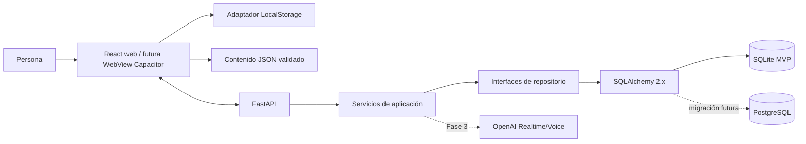

# Arquitectura general

## Contexto

SpeakFlowAI adopta una arquitectura web-first con un frontend React, una API FastAPI y persistencia SQLite local. En Fase 3, el backend será el único componente que se comunica con OpenAI usando credenciales privadas.

## Capas y dependencias

1. **Presentación:** React, rutas, accesibilidad y estados de interfaz.
2. **Aplicación frontend:** casos de uso, adaptadores de API, LocalStorage y contenido.
3. **API:** contratos HTTP/tiempo real, validación y traducción segura de errores.
4. **Aplicación backend:** orquestación de sesiones, revisión y progreso.
5. **Dominio:** entidades y reglas independientes de frameworks y motor SQL.
6. **Infraestructura:** SQLAlchemy, SQLite, proveedor de IA y sistema de archivos.

Las dependencias apuntan hacia el dominio. La lógica de aprendizaje no importa SQLite, SQLAlchemy ni SDK de OpenAI.

## Límites de confianza

- El navegador no es un almacén de secretos.
- FastAPI valida toda entrada aunque el frontend ya la haya validado.
- La clave de OpenAI permanece en variables de entorno del backend.
- Los tokens efímeros, cuando la integración los requiera, tienen mínimo alcance y vida corta.
- Audio y buffers temporales no se persisten.
- Los errores del proveedor se traducen a categorías públicas estables.

## Contratos

- API versionada bajo `/api/v1`.
- Tipos compartidos generados o validados desde esquemas estables; no se copian manualmente.
- Fechas transmitidas en ISO 8601 UTC.
- Identificadores UUID independientes del motor.
- Contenido público usa IDs semánticos estables, por ejemplo `scenario.workplace-daily-standup`.
- Cambios incompatibles requieren migración o versión nueva.

## Configuración

La precedencia será: valores seguros predeterminados → archivo `.env` local no versionado/backend → variables del entorno de despliegue. La configuración se valida al inicio y falla con un mensaje para desarrolladores que no revela secretos.

Variables previstas:

- `SPEAKFLOW_ENV`
- `SPEAKFLOW_DATABASE_URL`
- `SPEAKFLOW_DATA_DIR`
- `SPEAKFLOW_LOG_LEVEL`
- `OPENAI_API_KEY` desde Fase 3

## Observabilidad del MVP

- Logs estructurados del backend con ID de correlación.
- Sin audio, transcripción completa ni claves en logs.
- Eventos locales de ciclo de sesión y errores sanitizados.
- Métricas de coste y duración en Fase 3 sin perfilar contenido sensible.

## Despliegue

El frontend y VitePress producen artefactos estáticos. GitHub Pages puede alojar documentación y, opcionalmente, el frontend estático. FastAPI, SQLite en producción local o un futuro PostgreSQL, y secretos requieren un entorno backend separado.

## Criterios de aceptación arquitectónica

- Una prueba de servicio de aplicación puede usar un repositorio en memoria.
- Cambiar el adaptador SQL no altera casos de uso.
- El frontend puede ejecutar el tutor determinista sin conexión al proveedor.
- No hay importaciones de infraestructura desde dominio.
- Las rutas de datos se configuran fuera de directorios fuente.
- Cada frontera dispone de validación y un error público controlado.
