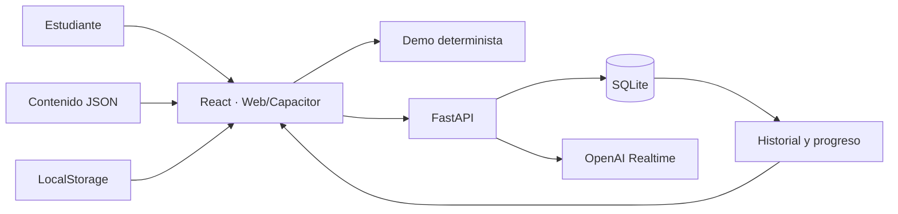
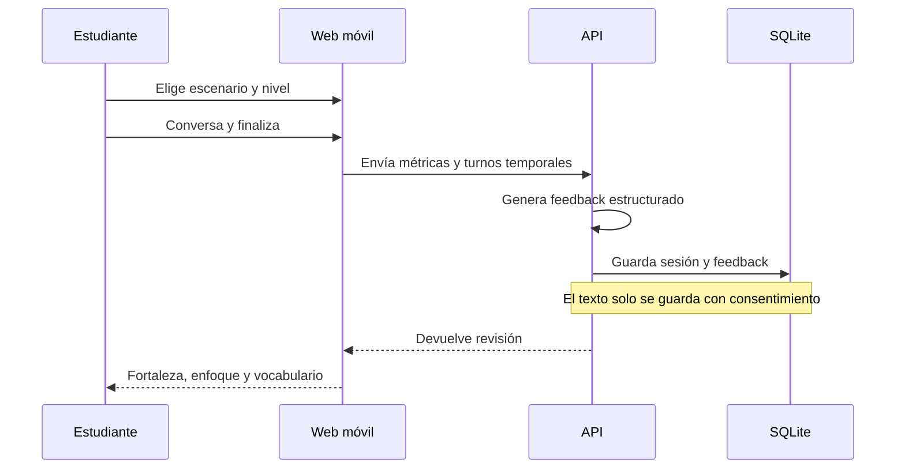

# Caso de estudio

## SpeakFlowAI

**Reto:** muchas personas adultas estudian inglés durante años, pero practican
poco el acto de hablar porque las herramientas mezclan demasiadas opciones,
juicio y fricción técnica.

**Respuesta:** un compañero de práctica sereno, mobile-first y sin cuenta. La
persona elige una situación, conversa por voz o con una demo local, recibe una
revisión breve y observa su progreso sin entregar más datos de los necesarios.

## Decisiones que moldearon el producto

1. **Valor antes que infraestructura.** El recorrido completo funciona con un
   tutor determinista, incluso sin proveedor externo.
2. **Voz mediada por backend.** OpenAI Realtime usa WebRTC, pero la clave nunca
   entra en el bundle ni en el dispositivo.
3. **Privacidad por defecto.** No se guarda audio y la transcripción cruda solo
   se conserva con consentimiento explícito.
4. **Datos con responsabilidades claras.** SQLite mantiene producto, LocalStorage
   preferencias y JSON contenido editorial versionado.
5. **Una web, tres superficies.** React alimenta navegador, Android e iOS mediante
   Capacitor.

## Arquitectura entregada

## Recorrido principal

## Resultado verificable

- onboarding reanudable y cuatro escenarios locales;
- voz Realtime con controles, límites y recuperación;
- feedback, historial, racha y progreso persistentes;
- 20 pruebas backend y 24 pruebas TypeScript;
- auditoría de dependencias sin vulnerabilidades conocidas;
- bundle web de 322,17 kB JavaScript tras integrar Capacitor;
- APK debug reproducible de 4,24 MB;
- documentación buscable y publicación estática reproducible.

## Qué sigue después del MVP

- validar audio real con una credencial controlada;
- probar iOS con Xcode y ambos sistemas en dispositivos físicos;
- sustituir el feedback determinista por análisis asistido con evaluación humana;
- incorporar cuentas y sincronización solo cuando exista una necesidad validada;
- migrar a PostgreSQL cuando concurrencia y despliegue lo justifiquen.
