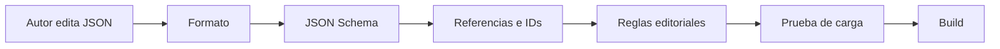

# Estrategia de contenido JSON

## Propósito

JSON contiene material estático o semiestático que se publica con una versión de la aplicación. No sustituye a SQLite para datos creados o modificados frecuentemente por el usuario.

## Contenido apropiado

- modos de aprendizaje;
- escenarios y roles;
- lecciones guiadas;
- preguntas de entrevista;
- vocabulario de soporte de TI;
- frases comunes;
- plantillas de prompts sin secretos;
- niveles de dificultad;
- definiciones de logros;
- valores predeterminados;
- demos y fixtures sintéticos;
- navegación y metadatos documentales;
- feature flags solo para desarrollo local.

## Estructura prevista

```text
content/
├── learning-modes/
├── scenarios/
├── lessons/
├── vocabulary/
├── prompts/
└── schemas/
```

Las carpetas y archivos se crean solo cuando la fase activa los necesita. Fase 0 define el contrato; Fase 2 agrega el contenido inicial.

## Fuente de contrato

- JSON Schema Draft 2020-12 es la fuente portable.
- Ajv validará en TypeScript durante carga, pruebas y CI.
- Los modelos backend necesarios se derivarán o mantendrán con pruebas de contrato contra los mismos ejemplos.
- Cada formato tiene `$id`, `schemaVersion` e identificadores estables.

## Ejemplo conceptual de escenario

```json
{
  "schemaVersion": 1,
  "id": "scenario.workplace-daily-standup",
  "modeId": "mode.workplace",
  "status": "published",
  "difficulty": ["b1", "b2"],
  "durationMinutes": 8,
  "titleKey": "scenario.workplace.dailyStandup.title",
  "summaryKey": "scenario.workplace.dailyStandup.summary",
  "objectiveKey": "scenario.workplace.dailyStandup.objective",
  "roles": {
    "learner": "team-member",
    "tutor": "facilitator"
  },
  "promptTemplateId": "prompt.roleplay.workplace.v1",
  "tags": ["workplace", "meetings"]
}
```

El texto mostrado se referencia mediante claves para permitir localización; los IDs internos nunca se traducen.

## Reglas editoriales y de seguridad

1. Un concepto tiene una fuente; otros archivos lo referencian por ID.
2. Los IDs publicados no se reutilizan con otro significado.
3. Eliminar contenido requiere estado `deprecated` y alias/migración cuando exista historial.
4. Prompts no incluyen secretos ni datos de empleadores.
5. Empresas, personas, dispositivos e incidentes son ficticios.
6. Cada nivel declara objetivos observables, no juicios sobre la persona.
7. Las instrucciones pueden mostrarse en inglés y español sin mezclar IDs.
8. Un archivo inválido genera un error legible y conserva navegación hacia contenido válido.

## Flujo de validación



## Criterios de aceptación

- Cada tipo importante tiene esquema y ejemplos válidos/inválidos.
- Duplicados y referencias inexistentes fallan en CI.
- Texto e ID están separados.
- El cargador devuelve un resultado controlado, no una excepción visible al usuario.
- No hay contenido real confidencial.
- Se puede añadir otro idioma sin cambiar IDs ni datos de historial.
