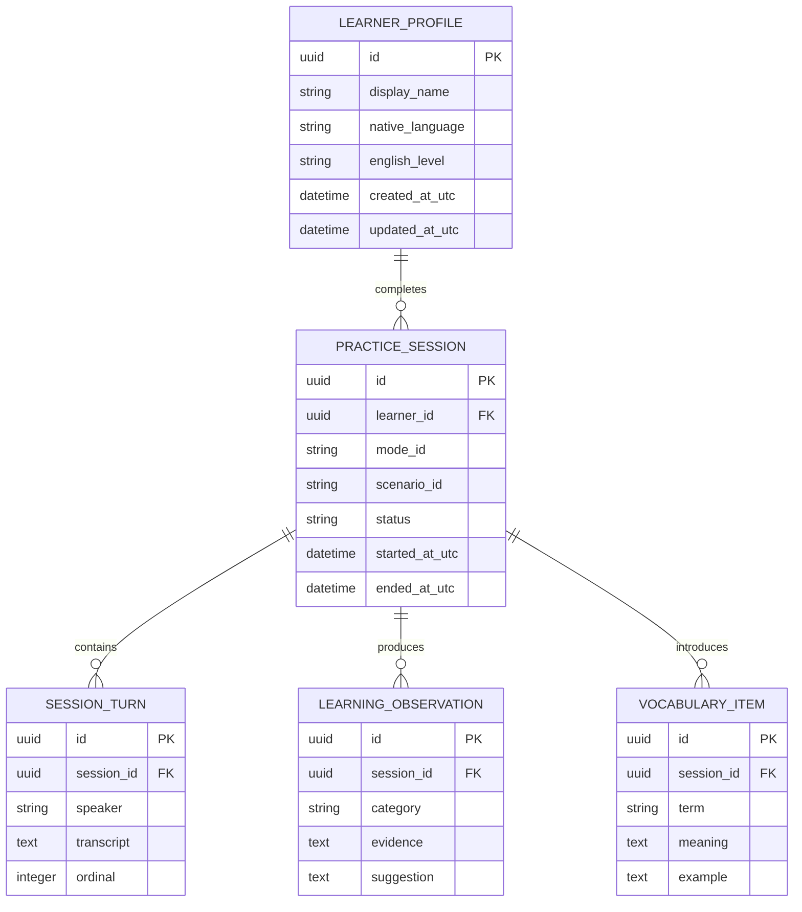

# Estrategia de base de datos

## Decisión

El MVP usa **SQLite con SQLAlchemy 2.x y Alembic**. SQLite elimina la dependencia de un servidor para el primer usuario local; SQLAlchemy y la separación por repositorios mantienen abierta una migración posterior a PostgreSQL.

## Ubicación y configuración

- Ruta de desarrollo recomendada: `./data/speakflowai-dev.db`, configurable mediante `SPEAKFLOW_DATABASE_URL`.
- `data/` pertenece a la raíz, no a `apps/web/src` ni `apps/api/src`.
- `*.db`, `*.sqlite`, `*.sqlite3`, archivos WAL/SHM y copias locales se ignoran en Git.
- `data/.gitkeep` y `data/README.md` podrán versionarse en Fase 1, nunca la base de ejecución.
- Los tests usan bases temporales aisladas.

## Herramientas seleccionadas

- **ORM/toolkit:** SQLAlchemy 2.x con estilo tipado.
- **Migraciones:** Alembic desde la primera tabla.
- **Validación de API:** modelos Pydantic separados de los modelos de persistencia.
- **IDs:** UUID almacenados mediante un tipo portable con representación textual canónica.
- **Tiempo:** `datetime` consciente de zona, normalizado a UTC.

## Reglas de portabilidad

1. Activar `PRAGMA foreign_keys=ON` en cada conexión SQLite.
2. Definir `NOT NULL`, `UNIQUE`, `CHECK` y claves foráneas explícitas.
3. No depender del tipado permisivo de SQLite.
4. Evitar SQL crudo; aislarlo cuando sea imprescindible.
5. No usar lógica de negocio basada en `rowid`, `AUTOINCREMENT`, JSON1 o funciones exclusivas.
6. Usar tipos portables: UUID abstraído, `String` con límites, `Text`, `Boolean`, `Integer`, `DateTime(timezone=True)`.
7. No almacenar listas o diccionarios esenciales como texto JSON si deben consultarse relacionalmente.
8. Ordenar explícitamente consultas con paginación.
9. Ejecutar cambios solo por migraciones, nunca con `create_all` en entornos persistentes.
10. Mantener repositorios y transacciones en la capa de infraestructura.

## Modelo conceptual

`SESSION_TURN` solo se persiste si el usuario habilita almacenamiento de transcripción. El modelo final se concreta en Fase 1 mediante migración revisable.

## Transacciones y concurrencia

- Una unidad de trabajo por solicitud o comando.
- Escrituras breves; no mantener transacciones mientras se espera al servicio de voz.
- Reintentos limitados solo para operaciones idempotentes y errores transitorios reconocidos.
- WAL puede evaluarse como configuración local aislada, pero no será una regla de dominio.
- Si aparecen múltiples procesos escritores o contención sostenida, evaluar PostgreSQL.

## Copia, restauración y reinicio

- **Copia segura:** detener escrituras y usar la API de backup de SQLite o una herramienta documentada; no copiar a ciegas durante actividad.
- **Restauración:** conservar la copia actual, reemplazar la base con la aplicación detenida, ejecutar migraciones y validar integridad.
- **Reinicio de desarrollo:** eliminar solo la base configurada dentro de `data/`, recrear mediante Alembic y cargar semillas sintéticas opcionales.
- Antes de automatizar cualquier eliminación, resolver y validar la ruta exacta.

## Migración futura a PostgreSQL

### Disparadores

- múltiples usuarios autenticados;
- persistencia compartida en nube o varias instancias;
- concurrencia de escritura superior a la adecuada para SQLite;
- informes avanzados o mayor volumen de transcripciones;
- cuentas de equipo/organización;
- requisitos operativos de backup, alta disponibilidad o servicio administrado.

### Ruta

1. Ejecutar la suite de integración existente contra PostgreSQL.
2. Corregir diferencias de tipos, zona horaria, booleanos, orden y restricciones en adaptadores.
3. Crear infraestructura PostgreSQL sin cambiar servicios de aplicación.
4. Hacer un ensayo de exportación/importación con recuentos y checksums.
5. Detener escrituras, respaldar SQLite y ejecutar migración final.
6. Validar claves foráneas, IDs, timestamps, recuentos y muestras.
7. Cambiar `SPEAKFLOW_DATABASE_URL`.
8. Mantener rollback documentado hasta aceptación.

## Diferencias conocidas que deben probarse

- sensibilidad de mayúsculas/colaciones;
- tratamiento de tipos y booleanos;
- semántica de zona horaria;
- concurrencia y niveles de aislamiento;
- comportamiento de `NULL`, restricciones y alteración de tablas;
- funciones JSON o texto completo, que no se usarán sin adaptador.

## Criterios de aceptación

- Migración inicial y downgrade ensayados.
- Foreign keys activas y comprobadas.
- Base y archivos auxiliares ignorados por Git.
- Repositorios probables con SQLite temporal.
- Al menos un perfil de CI podrá ejecutar pruebas contra PostgreSQL cuando se introduzca esa dependencia, sin hacerlo obligatorio para desarrollo del MVP.
