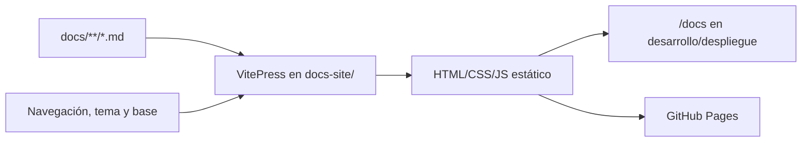

# Sitio de documentación

## Decisión

Se selecciona **VitePress** para generar el sitio HTML estático desde Markdown. La base ejecutable se crea en Fase 1; Fase 0 define su arquitectura.

## Evaluación

| Criterio                    | VitePress         | Docusaurus       | Astro Starlight | MkDocs Material     |
| --------------------------- | ----------------- | ---------------- | --------------- | ------------------- |
| Build simple en monorepo JS | Alto              | Medio            | Alto            | Medio, añade Python |
| Markdown/MDX                | Markdown + Vue/MD | MDX/React        | MD/MDX          | Markdown            |
| Búsqueda local sin backend  | Integrada         | Plugin           | Pagefind        | Integrada           |
| Mermaid                     | Plugin Markdown   | Plugin           | Integración     | Plugin              |
| GitHub Pages/base path      | Directo           | Directo          | Directo         | Directo             |
| Personalización ligera      | Alta              | Alta, mayor peso | Alta            | Alta                |
| Mantenimiento para MVP      | Bajo              | Medio            | Bajo/medio      | Medio               |

VitePress gana por el build pequeño, búsqueda local, salida estática y buena experiencia documental. Que use Vue internamente no acopla la aplicación React: el sitio es un paquete separado que consume `docs/`.

## Fuentes y salida

- Fuentes canónicas: `docs/`.
- Configuración y tema: `docs-site/`.
- Salida: directorio generado ignorado por Git.
- No se duplican documentos como páginas React.

## Experiencia

- Búsqueda local.
- Navegación responsive.
- Tabla de contenidos por página.
- Anterior/siguiente.
- Resaltado de sintaxis.
- Mermaid.
- Enlaces ancla en encabezados.
- Modo oscuro.
- Ancho de lectura accesible.
- Separación visible entre “Usar SpeakFlowAI” y “Construir SpeakFlowAI”.

## Navegación propuesta

### Usuario

- Introducción
- Empezar
- Modos de aprendizaje
- Guía de sesión de voz
- Revisión y progreso
- Solución de problemas
- Privacidad y datos locales

### Desarrollo

- Visión general
- Arquitectura
- Configuración local
- Contenido
- Base de datos
- API
- Pruebas
- Seguridad
- Despliegue
- Capacitor/móvil
- ADR
- Fases, tareas y estado
- Contribución

En Fase 1 se publican inicialmente los documentos existentes; las guías dependientes de funciones se completan con sus fases.

## Integración con la aplicación

- Enlace “Ayuda y documentación” visible desde Home y Configuración.
- En sesión activa, solo enlace contextual de solución de problemas; no navegación completa.
- En despliegue conjunto, documentación bajo `/docs/`.
- En desarrollo, comandos coordinados pero procesos independientes.
- En GitHub Pages, el sitio documental funciona sin backend.

## GitHub Pages

- `base` configurable desde variable de build o nombre de repositorio.
- Activos y enlaces internos base-aware.
- Sin rutas absolutas que presupongan dominio raíz.
- Build reproducible sin secretos.
- Artefacto estático desplegado mediante workflow en la fase apropiada.
- Dominio personalizado queda como mejora futura documentada.

## Búsqueda y Mermaid

- Búsqueda local preconstruida; no envía consultas a terceros.
- Mermaid se procesa con configuración restrictiva y contenido del repositorio.
- Diagramas tienen título/contexto textual; no son la única fuente de información.
- Diagramas grandes permiten scroll y mantienen legibilidad móvil.

## Validación

Al cierre de cada fase:

1. build de VitePress;
2. enlaces internos y anclas;
3. bloques de código;
4. sintaxis/render Mermaid;
5. entradas de sidebar;
6. navegación anterior/siguiente;
7. modo oscuro y responsive;
8. base path de GitHub Pages;
9. ausencia de secretos/datos privados.

## Criterios de aceptación

- Se puede leer el contenido como HTML sin backend.
- La búsqueda encuentra títulos y cuerpo.
- Usuario y desarrollador no comparten una lista plana.
- Las rutas funcionan en raíz y subruta.
- El enlace desde la aplicación es visible.
- Ningún documento expone secretos, transcripciones o credenciales.
