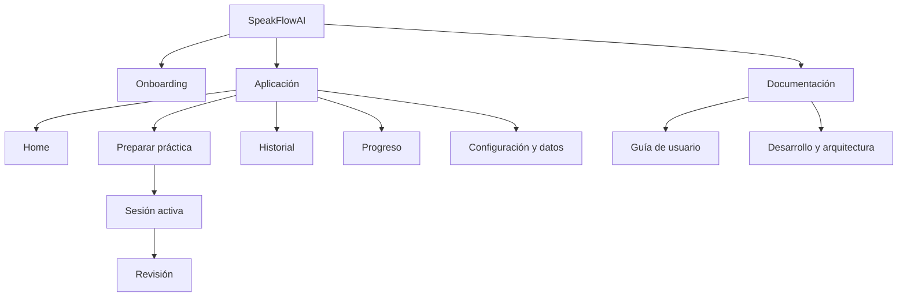

# Arquitectura de información

## Mapa de navegación

## Rutas conceptuales

| Ruta                          | Propósito                          | Navegación principal             |
| ----------------------------- | ---------------------------------- | -------------------------------- |
| `/onboarding`                 | Primera configuración local        | Solo primera apertura o reinicio |
| `/`                           | Home y recomendación               | Sí                               |
| `/practice`                   | Selección de modo/escenario        | Sí                               |
| `/practice/setup/:scenarioId` | Preparación esencial               | Contextual                       |
| `/session/:sessionId`         | Conversación inmersiva             | Sin navegación distractora       |
| `/review/:sessionId`          | Retroalimentación                  | Desde sesión/historial           |
| `/history`                    | Sesiones locales                   | Sí                               |
| `/progress`                   | Indicadores y patrones             | Sí                               |
| `/settings`                   | Preferencias, privacidad y borrado | Sí                               |
| `/docs/`                      | HTML documental                    | Enlace visible                   |

Las rutas son contratos de UX, no una implementación de router en Fase 0.

## Navegación por tamaño

| Contexto      | Patrón                                                                                     |
| ------------- | ------------------------------------------------------------------------------------------ |
| Móvil         | Barra inferior: Home, Practicar, Progreso, Más                                             |
| Tableta       | Barra inferior o rail compacto según ancho/orientación                                     |
| Escritorio    | Panel lateral: Home, Practicar, Historial, Progreso, Documentación; Configuración al final |
| Sesión activa | Navegación global oculta; solo volver/finalizar con intención explícita                    |

## Jerarquía de Home

1. Acción “Iniciar práctica”.
2. Recomendación y objetivo actual.
3. Continuar/repetir cuando exista historial.
4. Accesos a modos de aprendizaje.
5. Resumen de progreso breve.
6. Ayuda y documentación.

## Inventario de contenidos

- **Operativo:** estado de voz, conexión, permisos y acciones.
- **De aprendizaje:** objetivos, escenarios, instrucciones, correcciones y vocabulario.
- **Personal:** perfil local, preferencias, historial y progreso.
- **Documental:** guías de usuario, solución de problemas, arquitectura, API, seguridad, pruebas, despliegue, móvil, ADR, fases y estado.

## Reglas

- Una pantalla tiene una acción principal.
- Las opciones avanzadas usan revelado progresivo.
- La sesión activa minimiza texto y navegación.
- El mismo concepto conserva nombre e icono en todos los tamaños.
- La documentación de usuario y la técnica están separadas por navegación y etiquetado, no por fuentes duplicadas.

## Criterios de aceptación

- Toda ruta tiene entrada, salida y estado vacío definido.
- El botón Atrás del navegador no causa pérdida silenciosa.
- Los enlaces profundos a documentación funcionan con base path de GitHub Pages.
- El foco se mueve al encabezado principal al cambiar de vista.
- Las migas de pan se usan en documentación, no en la sesión activa.
