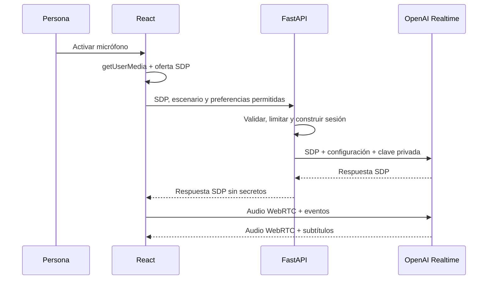

# Voz en tiempo real

## Decisión de conexión

SpeakFlowAI usa WebRTC mediante la interfaz unificada de OpenAI:

1. El navegador solicita el micrófono y genera una oferta SDP.
2. React envía esa oferta a `POST /api/v1/realtime/session`.
3. FastAPI agrega una configuración de sesión controlada y llama a `POST /v1/realtime/calls` con la clave estándar.
4. FastAPI devuelve únicamente la respuesta SDP.
5. El navegador completa la conexión WebRTC y usa el canal de datos para eventos.

La clave estándar nunca llega al navegador. La [guía WebRTC oficial](https://developers.openai.com/api/docs/guides/realtime-webrtc) recomienda WebRTC sobre WebSockets para clientes web o móviles y describe esta interfaz unificada.



## Modelo y coste

El valor predeterminado es `gpt-realtime-2.1-mini`, elegido para una primera experiencia sensible al coste. Puede cambiarse mediante `SPEAKFLOW_REALTIME_MODEL` sin modificar el frontend.

Controles activos:

- máximo de 350 tokens de salida por respuesta;
- máximo de 15 minutos por sesión en el cliente;
- cinco inicios de sesión por proceso cada diez minutos;
- respuestas de menos de 45 palabras mediante instrucciones;
- VAD de servidor para evitar enviar silencio como turnos;
- lectura del uso desde eventos `response.done`;
- botón explícito para terminar y cierre de pistas, canal y conexión.

La [guía oficial de costes Realtime](https://developers.openai.com/api/docs/guides/realtime-costs) explica que cada turno reutiliza la conversación acumulada y que los turnos posteriores pueden ser más costosos. Por eso el MVP limita duración, salida y cantidad de reinicios.

## Privacidad y seguridad

- `OPENAI_API_KEY` existe solo en el entorno de FastAPI.
- El backend agrega un identificador de seguridad estable y no personal.
- No se persiste audio.
- Los errores del proveedor se convierten en códigos públicos controlados.
- Las respuestas SDP usan `Cache-Control: no-store`.
- El backend acepta solo escenarios, voces y velocidades de listas permitidas.
- El tamaño máximo de la oferta SDP es 100 kB.

## Recuperación

La interfaz distingue permiso denegado, API sin configurar, límite temporal, pérdida de conexión y fallo del proveedor. Puede reintentar la conexión o cambiar a la demo determinista sin perder el escenario elegido.

## Configuración

```text
OPENAI_API_KEY=<solo en el backend>
SPEAKFLOW_REALTIME_MODEL=gpt-realtime-2.1-mini
SPEAKFLOW_REALTIME_MAX_OUTPUT_TOKENS=350
SPEAKFLOW_REALTIME_SESSION_LIMIT_MINUTES=15
```

Sin `OPENAI_API_KEY`, el endpoint devuelve `503 realtime_not_configured` y la experiencia local continúa disponible.

## Evidencia con proveedor real

El 2026-07-31 se verificaron una clave local sin exponerla, el acceso a
`gpt-realtime-2.1-mini`, la creación de una llamada SDP mediante FastAPI y la
apertura del canal WebRTC en estado `connected/open`. La última comprobación
manual consiste en hablar por el micrófono y confirmar audio audible en ambos
sentidos desde la interfaz.
