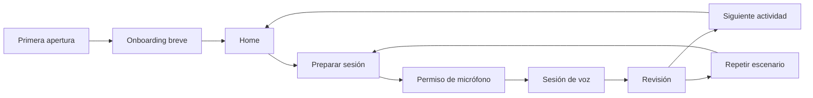
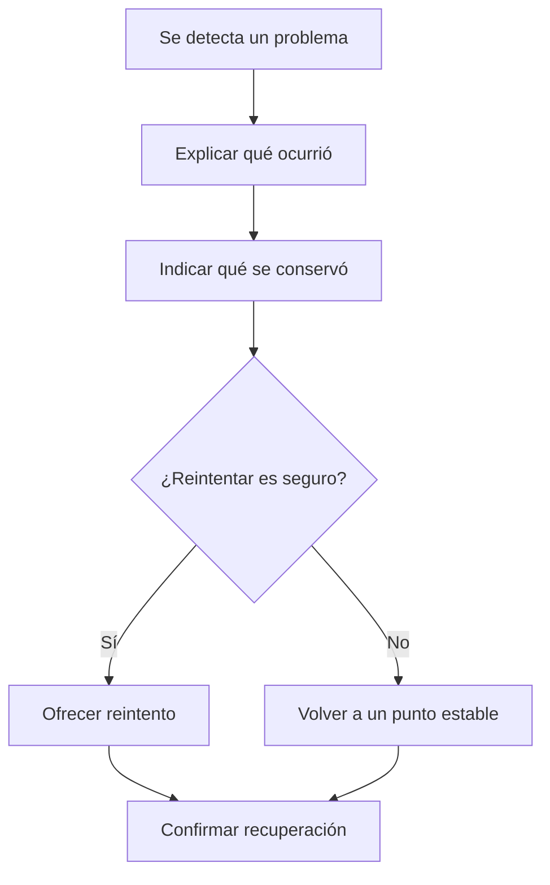

# Recorridos del usuario

## Flujo principal

## J1. Primera apertura

**Objetivo:** llegar a una recomendación útil sin crear una cuenta.

1. La bienvenida explica en una frase el valor y el uso del micrófono.
2. La persona selecciona nivel de inglés.
3. Selecciona objetivos y temas relevantes.
4. Ajusta velocidad, apoyo en español y voz del tutor.
5. Revisa un resumen editable y entra a Home.

**Reglas:** máximo seis decisiones cortas; se puede retroceder; no se solicita micrófono todavía; los valores se guardan mediante el adaptador LocalStorage.

**Aceptación:** completar con teclado, lector de pantalla y viewport de 320 px; recuperar una interrupción sin perder respuestas; editar preferencias después.

## J2. Iniciar práctica recomendada

**Objetivo:** hablar con el menor número de pasos.

1. Home muestra una recomendación y “Iniciar práctica”.
2. La preparación presenta modo, escenario, dificultad, voz, velocidad, subtítulos y duración/objetivo.
3. La persona confirma y solo entonces se solicita permiso de micrófono.
4. Una comprobación explica si el permiso fue rechazado y cómo recuperarlo.
5. La sesión empieza en estado inequívoco.

**Aceptación:** una persona que ya completó onboarding llega a iniciar en tres acciones principales o menos usando la recomendación.

## J3. Mantener una conversación

**Objetivo:** conversar sin vigilar detalles técnicos.

1. El objetivo del escenario permanece visible pero discreto.
2. Un orbe de actividad, una etiqueta textual y el control del micrófono comunican el estado.
3. La persona puede silenciar, interrumpir al tutor, pedir repetición o menor velocidad.
4. Los subtítulos son opcionales y no desplazan los controles.
5. Una desconexión conserva el contexto local y ofrece reconexión segura.

**Aceptación:** nunca hay ambigüedad sobre el micrófono; todos los controles críticos tienen texto/etiqueta; el orbe no afirma medir pronunciación.

## J4. Terminar y aprender

**Objetivo:** convertir la conversación en una mejora concreta.

1. Finalizar pide confirmación solo si evita una pérdida real.
2. La revisión muestra primero un acierto.
3. Presenta hasta tres correcciones prioritarias y frases mejoradas.
4. Ofrece vocabulario nuevo y una observación de escucha/pronunciación sin diagnóstico científico.
5. Recomienda una actividad, repetir escenario o revisar transcripción cuando esté habilitada.

**Aceptación:** el resumen cabe en una lectura corta, utiliza lenguaje alentador y conserva la sesión aun si falla la generación de una parte de la revisión.

## J5. Continuar progreso local

**Objetivo:** retomar sin cuenta.

1. Home ofrece continuar la última sesión o repetir el escenario.
2. Historial permite abrir revisiones previas.
3. Progreso resume constancia, escenarios practicados y patrones recurrentes.
4. La persona puede borrar sus datos locales desde Configuración.

**Aceptación:** las métricas no comparan con otras personas ni usan rachas de forma punitiva; borrar datos requiere una confirmación clara y explica el alcance.

## J6. Recuperarse de un error

Mensajes previstos: permiso denegado, micrófono no disponible, red desconectada, servicio de IA no disponible, límite de sesión, navegador incompatible, audio bloqueado e inicialización fallida. Nunca se muestran trazas ni errores crudos del proveedor.
