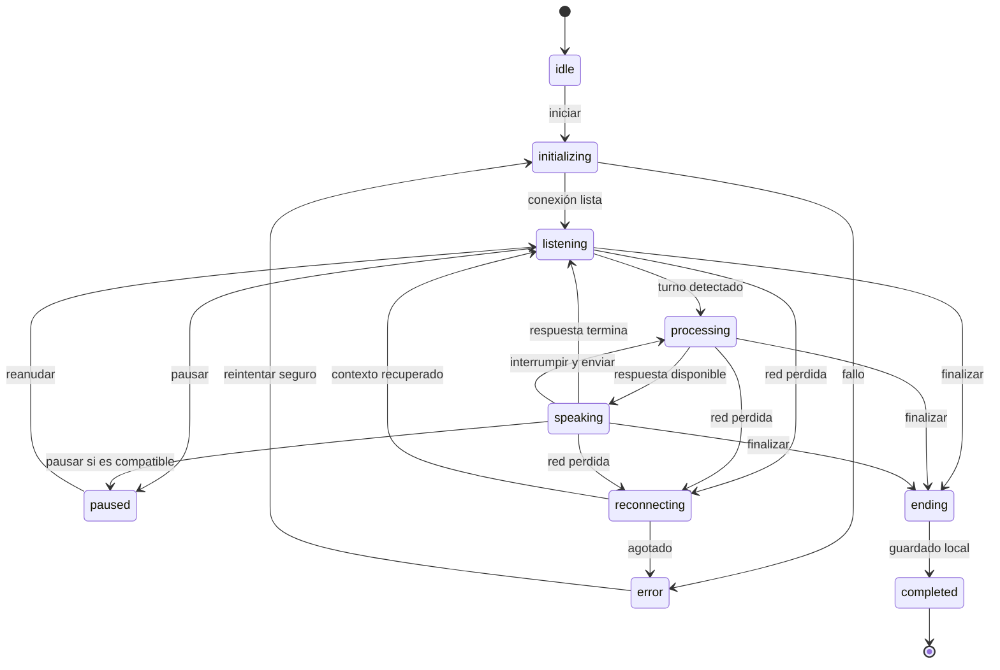

# Diseño de experiencia

## Dirección: Calm Momentum

SpeakFlowAI debe sentirse como un estudio tranquilo para conversar, no como un panel administrativo ni un juego infantil. “Calm Momentum” combina superficies serenas, lenguaje alentador y una señal de actividad viva que hace visible el progreso sin presión.

## Principios de interacción

- La práctica es la acción dominante.
- Cada estado técnico se traduce a lenguaje humano.
- La interfaz celebra claridad y constancia, no perfección.
- La retroalimentación empieza por lo que funcionó.
- Las opciones avanzadas permanecen fuera del camino principal.
- Animación y sonido apoyan el estado, nunca son la única señal.
- La persona conserva control para silenciar, interrumpir y finalizar.

## Onboarding

### Pantallas

1. **Bienvenida:** propuesta de valor y nota breve de privacidad local.
2. **Nivel:** A2, B1, B2, C1 o “No estoy seguro”, con ejemplos sencillos.
3. **Objetivos:** conversación, trabajo, soporte de TI, entrevistas u otro.
4. **Temas:** selección opcional de intereses.
5. **Tutor:** velocidad, voz y ayuda en español.
6. **Listo para practicar:** resumen editable y CTA.

### Comportamiento

- Indicador “Paso n de 6” con nombre del paso.
- Atrás conserva respuestas.
- Saltar solo en preguntas opcionales.
- Valores recomendados claramente explicados.
- Micrófono se solicita al iniciar la primera sesión, con contexto.
- Al interrumpirse, vuelve al último paso completo.

### Criterios

- No exige nombre ni cuenta.
- El nivel “No estoy seguro” produce una recomendación segura.
- Todas las selecciones tienen etiqueta, descripción y foco visible.
- El cierre lleva a Home con recomendación ya preparada.

## Home

### Composición

1. Saludo neutral y objetivo actual.
2. Tarjeta hero “Práctica recomendada” con “Iniciar práctica”.
3. Acción secundaria “Continuar” o “Repetir” si existe historial.
4. Modos en tarjetas compactas.
5. Resumen de progreso con máximo tres indicadores.
6. Enlace visible a ayuda/documentación.

### Estados

- **Nuevo:** explica por qué se recomienda la primera sesión.
- **Con historial:** prioriza continuar o variar escenario.
- **Sin datos disponibles:** permite practicar sin estadísticas.
- **Error parcial:** conserva CTA y explica qué resumen no se pudo cargar.

## Preparación de sesión

### Opciones visibles

- modo;
- escenario;
- dificultad;
- voz;
- velocidad;
- subtítulos;
- objetivo o duración.

Los ajustes avanzados se muestran en un acordeón o sheet. Un resumen indica qué ocurrirá y si la transcripción se guardará.

### Acciones

- Principal: “Iniciar conversación”.
- Secundaria: “Probar audio” cuando sea técnicamente útil.
- Terciaria: volver sin perder preferencias.

## Sesión activa

### Jerarquía

1. Etiqueta textual del estado y conexión.
2. Orbe de actividad central.
3. Objetivo del escenario.
4. Subtítulos opcionales.
5. Controles principales.
6. Duración/progreso y ajustes discretos.

### Estados

### Definición visual y verbal

| Estado       | Etiqueta                     | Orbe                    | Acción dominante    |
| ------------ | ---------------------------- | ----------------------- | ------------------- |
| Inactivo     | “Listo para empezar”         | Quieto, borde tenue     | Iniciar             |
| Preparando   | “Preparando tu conversación” | Pulso lento             | Cancelar            |
| Escuchando   | “Te escucho”                 | Expansión suave         | Silenciar           |
| Procesando   | “Preparando respuesta”       | Rotación contenida      | Esperar/interrumpir |
| Hablando     | “Tu tutor está hablando”     | Ondas suaves            | Interrumpir         |
| Pausa        | “Conversación en pausa”      | Quieto con icono        | Reanudar            |
| Reconectando | “Recuperando conexión”       | Pulso ámbar             | Reintentar/terminar |
| Error        | Mensaje específico           | Quieto, señal de alerta | Recuperación segura |

El orbe representa actividad, no volumen exacto, calidad de pronunciación ni análisis médico/científico.

### Controles

| Control             | Disponibilidad                   | Respuesta                           |
| ------------------- | -------------------------------- | ----------------------------------- |
| Silenciar/reactivar | Siempre durante sesión           | Estado y anuncio inmediato          |
| Interrumpir tutor   | Mientras habla                   | Detiene audio y cambia estado       |
| Repetir             | Tras una respuesta               | Reproduce o solicita repetición     |
| Más lento           | Durante o después de respuesta   | Confirma nueva velocidad            |
| Subtítulos          | Siempre                          | Muestra/oculta sin mover controles  |
| Pausa               | Solo si se soporta con seguridad | Explica limitación si no            |
| Finalizar           | Siempre                          | Conserva lo posible y abre revisión |

El botón de micrófono combina icono, etiqueta y estado accesible. Silenciado nunca comparte color, texto o animación con “Te escucho”.

### Lectura continua de la conversación

- El turno más reciente permanece visible en la parte inferior.
- Cada turno nuevo desplaza la conversación automáticamente mientras la persona
  sigue leyendo el final.
- Si la persona sube para consultar un turno anterior, el desplazamiento se
  suspende y aparece “Volver al final”.
- Una transcripción incorrecta se puede excluir de la revisión sin ocultarla ni
  alterar otros turnos.
- La barra de desplazamiento es discreta, pero conserva teclado, rueda y gestos.

Antes de solicitar el micrófono se comprueban navegador, red, API y disponibilidad
del servicio de voz. La pantalla principal usa lenguaje humano; WebRTC, tokens y
otros diagnósticos permanecen dentro de “Detalles técnicos”.

## Revisión de sesión

### Orden

1. “Lo que hiciste bien”.
2. Hasta tres correcciones prioritarias.
3. “Una forma más natural de decirlo”.
4. Vocabulario nuevo.
5. Observación de escucha/pronunciación con lenguaje prudente.
6. Próxima actividad recomendada.

### Acciones

- Repetir escenario.
- Practicar recomendación.
- Escuchar o copiar frases mejoradas cuando el navegador lo permita.
- Ver transcripción, solo si se guardó.
- Volver a Home.

Un fallo de análisis parcial no invalida la sesión: se muestra lo disponible y se puede reintentar la revisión.

## Errores

Cada error responde:

1. qué ocurrió;
2. qué se conservó;
3. qué puede hacer la persona;
4. si reintentar es seguro.

Ejemplo: “SpeakFlowAI no tiene acceso al micrófono. Tu configuración está guardada. Permite el micrófono en el navegador y vuelve a intentarlo; es seguro hacerlo.”

## Componentes de experiencia

- App shell responsive.
- Practice recommendation card.
- Mode/scenario card.
- Stepper de onboarding.
- Preference field.
- Session status announcer.
- Activity orb.
- Connection badge.
- Caption panel.
- Session control dock.
- Feedback card.
- Progress summary.
- Empty/error state.
- Mobile sheet / desktop dialog.
- Toast solo para confirmaciones no críticas.

## Accesibilidad

- Región `aria-live` moderada para cambios de voz; no anunciar cada animación.
- Foco visible y orden lógico.
- Etiquetas persistentes en acciones críticas.
- Reducción de movimiento elimina pulsos continuos.
- Estado no depende solo de color.
- Correcciones usan “Tu frase / Opción sugerida”, no rojo como juicio.
- Subtítulos ajustables y con contraste.
- Soporte a zoom 200 % y reflow.

## Criterios de aceptación de Fase 0

- Todas las pantallas críticas tienen objetivo, jerarquía, estados y recuperación.
- La máquina de estados cubre conexión, pausa, error y finalización.
- Los controles se pueden mapear a etiquetas y acciones accesibles.
- El diseño reduce texto durante conversación.
- La revisión propone un único siguiente paso principal.
