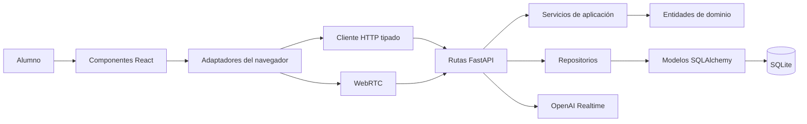
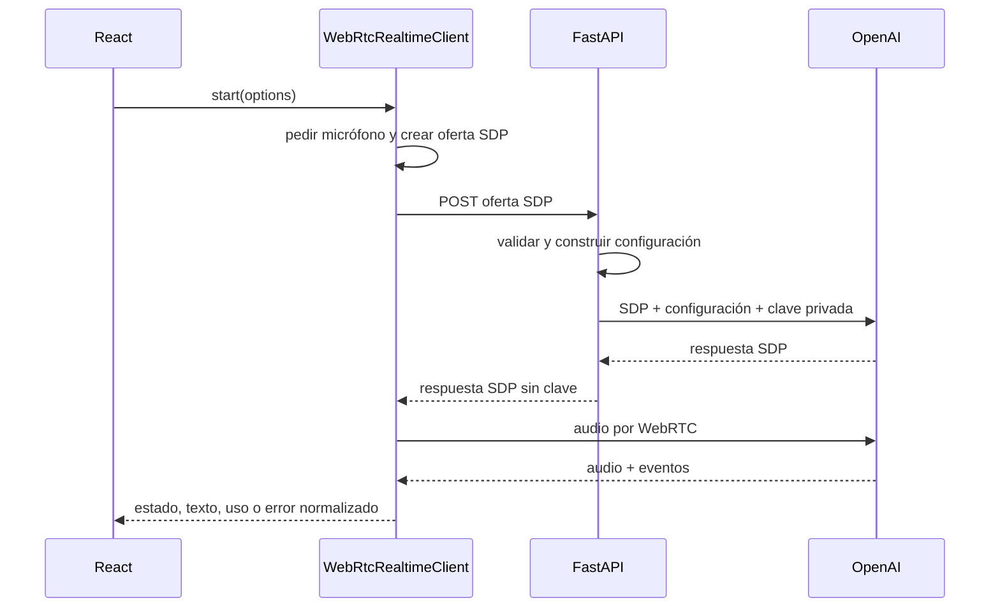

# Recorrido guiado por el código

## Para quién es esta guía

Esta página acompaña a una persona que conoce variables, funciones, clases,
HTTP y bases de datos, pero todavía está aprendiendo a reconocer cómo esas piezas
forman una aplicación completa. No hace falta entender WebRTC o SQLAlchemy antes
de comenzar: cada frontera se puede estudiar de manera aislada.

## Modelo mental en una frase

React recoge una intención del alumno, los adaptadores la convierten en contratos
tipados, FastAPI valida esos contratos, la aplicación crea entidades de dominio y
los repositorios deciden cómo guardarlas en SQLite.



## Orden recomendado de lectura

### 1. Empezar por un objeto pequeño

Lee `apps/api/src/speakflow_api/domain/learner.py`. `LearnerProfile` es una
`dataclass` inmutable: contiene datos, pero no conoce HTTP ni SQL. Esa separación
es la idea central del dominio.

Después compara el mismo concepto en tres fronteras:

- `api/learner_profile.py`: qué JSON acepta y devuelve FastAPI;
- `infrastructure/models.py`: cómo se representa en tablas;
- `repositories/learner_profiles.py`: cómo se traduce entre ambos mundos.

La entidad no cambia cuando cambia la tecnología de almacenamiento.

### 2. Seguir una práctica terminada

El flujo comienza en `completePractice` dentro de `apps/web/src/App.tsx`:

1. Un tutor produce `CompletedSession`.
2. `completePractice` calcula duración y crea `CompleteSessionInput`.
3. `SpeakFlowApiClient.completeSession` ejecuta `POST /api/v1/sessions`.
4. Pydantic valida `CompleteSessionPayload`.
5. La ruta crea `PracticeSession` y llama a `generate_feedback`.
6. `SqlAlchemyPracticeSessionRepository.add` construye el grafo ORM.
7. `transactional_session` confirma todo o revierte todo.
8. La respuesta vuelve como `PracticeSessionReview` y `ReviewPages.tsx` muestra
   `SessionReview`.

Si la API falla, `buildFallbackReview` mantiene una revisión en memoria y deja la
entrada original en `pendingSession` para que el botón Reintentar use exactamente
los mismos datos.

### 3. Estudiar configuración local

`packages/configuration/src/preferences.ts` demuestra un adaptador defensivo:

- Zod define el formato válido.
- `PREFERENCES_SCHEMA_VERSION` identifica su evolución.
- `PreferencesStorage.load` migra versiones antiguas.
- Datos corruptos recuperan valores seguros.
- Una versión futura se rechaza para evitar sobrescribir datos desconocidos.
- Los consumidores reciben un resultado discriminado en vez de una excepción.

Busca en `App` la función `updatePreferences`: React actualiza primero la pantalla
y después informa mediante un aviso si el navegador no pudo persistir el cambio.

### 4. Estudiar voz Realtime al final

La voz combina dos conexiones diferentes:



Archivos principales:

- `apps/web/src/realtimeClient.ts`: recursos del navegador y protocolo de eventos;
- `apps/api/src/speakflow_api/api/realtime.py`: validación, límites y configuración;
- `application/ports/realtime.py`: contrato independiente del proveedor;
- `infrastructure/openai_realtime.py`: llamada HTTP concreta a OpenAI.

La clave privada solo existe en los dos últimos pasos del backend. El navegador
nunca puede leerla.

## Mapa del frontend

La interfaz está dividida por responsabilidad. Empieza por `appTypes.ts`, continúa
por una pantalla pequeña y deja `App.tsx` para el final: así primero conoces las
piezas y después ves cómo se coordinan.

| Archivo                      | Símbolos principales                       | Responsabilidad educativa                           |
| ---------------------------- | ------------------------------------------ | --------------------------------------------------- |
| `appTypes.ts`                | `View`, `SessionSetup`, `CompletedSession` | Contratos que conectan módulos sin detalles de UI   |
| `sharedComponents.tsx`       | `ProductNavigation`, `SummaryItem`         | Componentes pequeños reutilizados entre pantallas   |
| `ConversationTranscript.tsx` | `ConversationTranscript`                   | Lectura anclada sin interrumpir a quien sube        |
| `VoiceReadiness.tsx`         | `checkVoiceReadiness`, `VoiceReadiness`    | Diagnóstico previo sin abrir el micrófono           |
| `LearningPhraseList.tsx`     | `LearningPhraseList`                       | Copia y pronunciación local de frases útiles        |
| `Onboarding.tsx`             | `Onboarding`, pasos y selectores           | Creación reanudable del perfil local                |
| `ProductPages.tsx`           | `Home`, `Catalog`, `Setup`                 | Descubrimiento y preparación de una práctica        |
| `RealtimeTutorSession.tsx`   | `RealtimeTutorSession`                     | Ciclo de vida WebRTC, audio y recuperación          |
| `TutorSession.tsx`           | `TutorSession`                             | Alternativa determinista sin voz ni red             |
| `ReviewPages.tsx`            | revisión, progreso y preferencias          | Resultados persistidos y configuración              |
| `App.tsx`                    | `App` y callbacks transversales            | Composición, navegación y coordinación de servicios |

Cada archivo comienza explicando su frontera y las funciones importantes conservan
su propósito, entradas, salidas y efectos. Ningún módulo de pantalla supera las
400 líneas; `App.tsx` quedó como orquestador en lugar de contener toda la interfaz.

Para seguir una acción, abre el componente que dibuja el botón, identifica el
callback recibido por propiedades y busca dónde `App` lo conecta con otro módulo.
Por ejemplo, `Setup` produce `SessionSetup`, `RealtimeTutorSession` produce
`CompletedSession` y `App.completePractice` lo transforma en una petición a la API.

## Mapa del backend

| Capa                | Pregunta que responde                    | Ejemplo                               |
| ------------------- | ---------------------------------------- | ------------------------------------- |
| `domain`            | ¿Qué conceptos existen?                  | `PracticeSession`                     |
| `application`       | ¿Qué regla o caso de uso ejecutamos?     | `generate_feedback`                   |
| `application/ports` | ¿Qué capacidad externa necesitamos?      | `RealtimeGateway`                     |
| `api`               | ¿Qué acepta y devuelve HTTP?             | `CompleteSessionPayload`              |
| `infrastructure`    | ¿Cómo usamos una tecnología concreta?    | `OpenAIRealtimeGateway`               |
| `repositories`      | ¿Cómo traducimos dominio y persistencia? | `SqlAlchemyPracticeSessionRepository` |

La dirección deseada de dependencias apunta hacia el dominio. Por eso
`domain/practice_session.py` no importa FastAPI, SQLAlchemy ni OpenAI.

## Tipos de datos que pueden confundirse

### Payload, dominio y modelo ORM

Los tres pueden describir una sesión, pero cumplen funciones diferentes:

- **Payload:** protege la frontera y representa JSON.
- **Dominio:** expresa el concepto del producto sin frameworks.
- **Modelo ORM:** expresa filas, claves foráneas y relaciones SQL.

Copiar un objeto de una capa directamente a otra parece más corto, pero une sus
ciclos de cambio. Las funciones `_response`, `_to_domain` y los repositorios hacen
visible esa traducción.

### Estado duradero y estado efímero

- Preferencias y sesiones pertenecen a almacenamiento duradero.
- `view`, `busy`, `loading`, `muted` y temporizadores son estado efímero.
- La transcripción solo es duradera con consentimiento.
- El audio nunca se convierte en estado persistente.

## Cómo leer los resultados discriminados

En TypeScript aparecen contratos como:

```ts
type Result<T> = { ok: true; value: T } | { ok: false; error: string };
```

Después de `if (result.ok)`, TypeScript sabe que existe `result.value`. En la otra
rama sabe que existe `result.error`. Esta técnica obliga a considerar el fallo y
evita usar excepciones para situaciones recuperables como red inactiva.

## Privacidad como parte del código

La privacidad no es solo documentación:

- `OPENAI_API_KEY` está excluida del `repr` de configuración.
- `HttpHardeningMiddleware` no registra cuerpos.
- `retain_transcript` decide si el repositorio crea filas de turnos.
- `PreferencesStorage` inicia esa opción en `false`.
- `WebRtcRealtimeClient.stop` detiene todas las pistas del micrófono.

## Cómo usar las pruebas para aprender

Lee una función y luego busca su archivo `*.test.*` o `test_*.py`:

1. identifica la entrada mínima;
2. observa el resultado verificable;
3. cambia mentalmente una precondición;
4. busca la prueba de recuperación o error;
5. ejecuta la prueba enfocada antes de editar.

Las pruebas de repositorios muestran traducción y privacidad. Las de preferencias
muestran migración y corrupción. Las de Realtime muestran estados sin necesitar
una conversación real.

## Ejercicios sugeridos

1. Añade un patrón determinista de corrección y su prueba.
2. Añade un nuevo tema de onboarding atravesando esquema, estado y payload.
3. Dibuja qué objetos se crean al guardar una práctica con y sin transcripción.
4. Simula un `ApiResult` de red y sigue la revisión local hasta Reintentar.
5. Explica por qué `WebRtcRealtimeClient` usa referencias y necesita `stop`.

Antes de cambiar código, consulta el
[estándar de documentación](./CODE_DOCUMENTATION_STANDARD.md) y conserva la
separación entre intención, contrato y detalle tecnológico.
