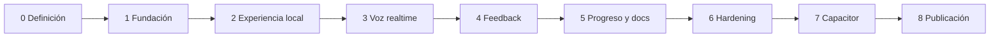

# Roadmap secuencial

## Regla

Solo una fase está activa. Cada fase depende del criterio de salida de la anterior. Un trabajo futuro puede documentarse, pero no implementarse antes de su turno.

## Fase 0 - Producto, UX, arquitectura y documentación

**Actividades:** definición, alcance, recorridos, IA, UX, responsive, sistema visual, datos, documentación, GitHub, pruebas, ADR y gobernanza.

**Salida:** documentos no vacíos, decisiones coherentes, trazabilidad completa y revisión humana. **Estado: lista para revisión.**

## Fase 1 - Fundación de ingeniería y diseño

**Actividades:** monorepo; React/FastAPI; SQLite/Alembic; adaptador LocalStorage; validación JSON; tokens/componentes; shell responsive; VitePress; CI rápida.

**Salida:** builds reproducibles, migración inicial, adaptadores probados, shell/documentación accesibles y validación de cierre. **Estado: lista para revisión.**

## Fase 2 - Experiencia local del estudiante

**Actividades:** onboarding; perfil; preferencias/tema; Home; modos/escenarios; carga JSON; setup; tutor falso determinista.

**Salida:** flujo local end-to-end sin proveedor, persistencia de preferencias y smoke crítico.

## Fase 3 - Voz en tiempo real

**Actividades:** integración OpenAI; inicialización segura por backend; controles/subtítulos; conexión/reconexión; móvil web; coste.

**Salida:** sesión de voz controlable, estados inequívocos, secretos solo backend y límites de coste.

## Fase 4 - Feedback de aprendizaje

**Actividades:** revisión; correcciones; vocabulario; frases mejoradas; observaciones; persistencia SQLite.

**Salida:** revisión breve, resiliente y persistida con consentimiento aplicable.

## Fase 5 - Progreso local y documentación

**Actividades:** historial; dashboard; errores recurrentes; búsqueda/navegación HTML; guía y troubleshooting.

**Salida:** progreso comprensible y sitio documental completo para usuario.

## Fase 6 - Endurecimiento de producción

**Actividades:** puerta completa de aceptación, unidad, propiedades, mutación, fuzz, integración, contrato, E2E, regresión, seguridad, resiliencia, rendimiento, compatibilidad, accesibilidad, docs y despliegue.

**Salida:** evidencia documentada sin bloqueos de producción.

## Fase 7 - Capacitor y móvil

**Actividades:** inicialización; iOS/Android; permisos; lifecycle; dispositivos; builds.

**Salida:** builds móviles verificables y documentación.

## Fase 8 - Publicación y portfolio

**Actividades:** revisión pública; Pages; despliegue; caso de estudio; diagramas; capturas; plan de video; release notes; 1.0.

**Salida:** publicación segura y reproducible.
